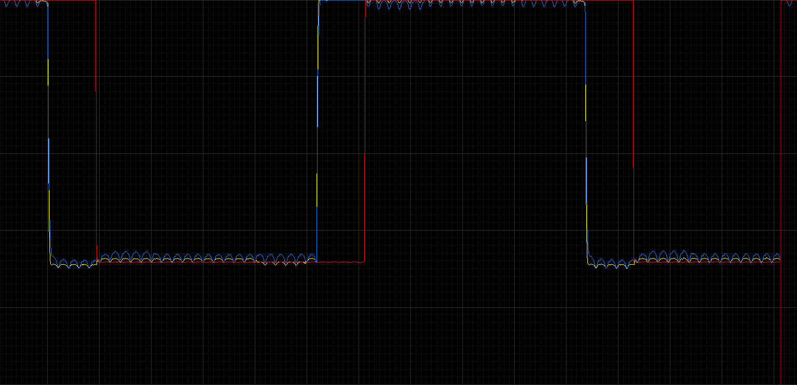
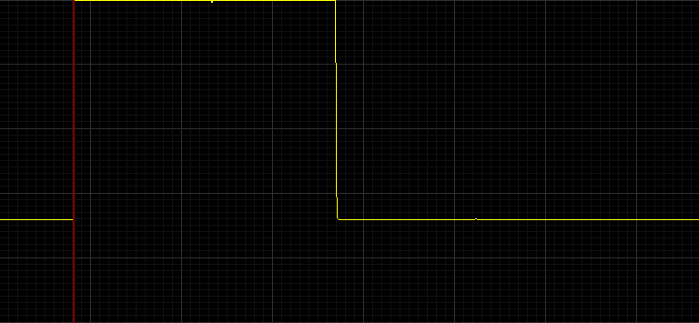
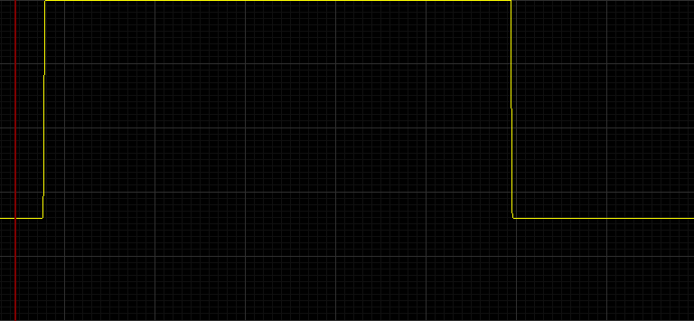

# Arduino Digital Storage Oscilloscope (Arduino-Oscilloscope)

A compact, DIY digital storage oscilloscope (DSO) and signal analyzer developed for the Arduino platform, featuring high-speed ADC sampling, standalone color TFT LCD waveform rendering, frequency/duty-cycle measurement, and PC data acquisition integration.

---

## Features

- **High-Speed Analog Acquisition**:
  - Overclocked/optimized ATmega328P ADC conversion loop achieving maximum sampling throughput on analog channels.
  - Software trigger synchronization (Rising edge / Falling edge trigger detection).
- **Standalone TFT Color Waveform Rendering**:
  - Direct waveform plotting with grid graticule on SPI TFT color displays (`TFT_Oscillo_v110`).
  - Dynamic vertical voltage scaling (Volts/Div) and horizontal timebase adjustment (Time/Div).
- **Automatic Parameter Extraction**:
  - Real-time calculation of signal frequency ($f = 1/T$) and duty cycle ($\%$).
  - Peak-to-peak voltage ($V_{pp}$), maximum voltage ($V_{max}$), and minimum voltage ($V_{min}$) estimation.
- **Dual Operating Modes**:
  - **Standalone Mode**: Self-contained benchtop instrument with on-board TFT screen and rotary/button controls.
  - **PC Interface Mode**: High-speed serial telemetry stream to PC data-logging software for CSV capture and FFT spectral analysis.
- **Hardware Integration Assets**:
  - KiCad 3D STEP models, footprints, and schematic symbols for Arduino Pro Mini carrier integration (`ARDUINO_PRO_MINI/`).

---

## Hardware Specification

| Subsystem | Component | Description |
| :--- | :--- | :--- |
| **Microcontroller** | Arduino Uno / Nano / Pro Mini | Microchip ATmega328P @ 16 MHz, 5V |
| **Analog Input** | Analog Pin A0 | Signal probe input with protection voltage divider |
| **Display** | 2.4" / 2.8" SPI TFT LCD | ILI9341 / ST7735 color graphical display |
| **Controls** | Tactile Pushbuttons | Timebase, voltage scale, and trigger hold controls |
| **PC Link** | Hardware UART / USB-Serial | 115200+ baud streaming interface |

---

## Live Waveform Captures & PC Telemetry

The PC data acquisition suite captures raw high-speed serial samples from the ATmega328P ADC conversion engine, providing real-time dual-trace visualization, persistence display, and CSV data export:

### Real-Time Dual-Channel PC Oscilloscope Interface
<p align="center">
  
</p>

### Single-Channel Signal Analysis & Trigger Synchronization

| Detailed Waveform View | Fast Sweep Zoom View |
| :---: | :---: |
|  |  |

---

## Project Structure

```text
Arduino-Oscilloscope/
├── TFT_Oscillo_v110/                 # Standalone TFT oscilloscope firmware
│   └── TFT_Oscillo_v110/
│       ├── TFT_Oscillo_v110.ino      # Main sketch & UI controller
│       ├── kit_scope.ino             # Display drawing & graticule routines
│       ├── i_scaleDataArray.ino      # Vertical scaling and offset algorithms
│       └── freqduty.ino              # Frequency and duty cycle calculator
├── oscilloscope_arduino/             # High-speed ADC capture & streaming firmware
│   └── oscilloscope_arduino/
│       └── oscilloscope_arduino.ino  # Serial acquisition firmware
├── ARDUINO_PRO_MINI/                 # KiCad hardware symbols & 3D STEP model
│   ├── ARDUINO_PRO_MINI.kicad_sym    # Schematic symbol
│   ├── MODULE_ARDUINO_PRO_MINI.kicad_mod # PCB footprint
│   └── ARDUINO_PRO_MINI.step         # 3D mechanical model
├── Arduino Oscilloscope/             # PC client capture configs and sample captures
├── .gitignore                        # Git ignore patterns
└── README.md                         # Project documentation
```

---

## Getting Started

1. Open `TFT_Oscillo_v110/TFT_Oscillo_v110/TFT_Oscillo_v110.ino` in the Arduino IDE.
2. Select **Arduino Uno** or **Arduino Pro Mini** under **Tools > Board**.
3. Connect the analog signal source to pin A0 (ensure input voltage stays strictly within 0V to 5V DC range; use a $10\times$ attenuator for higher voltages).
4. Flash the sketch to view live waveforms on the connected TFT display.

---

## License

Open-source embedded instrument firmware and hardware design. All rights reserved by the author.
